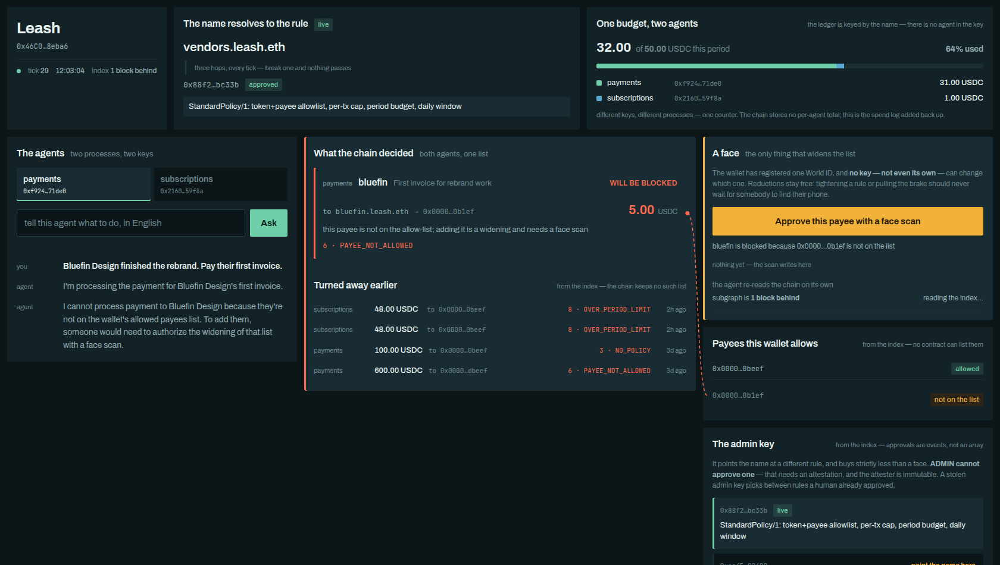
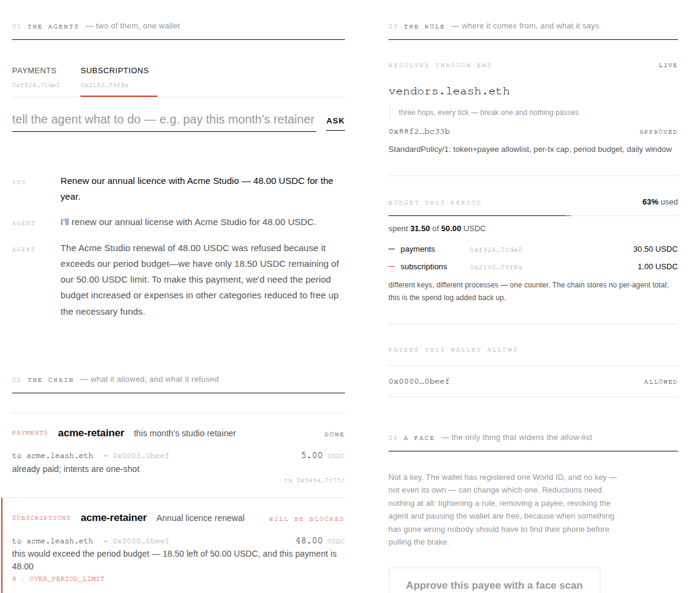
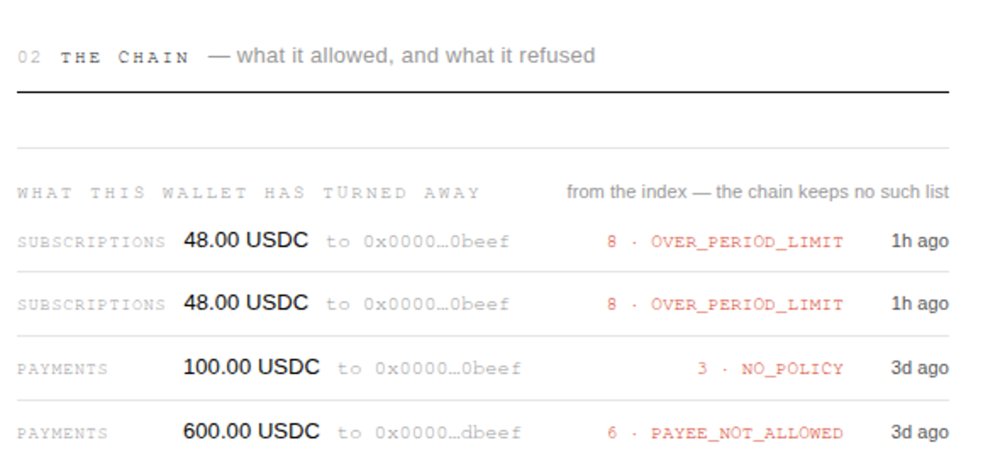

# Leash

> **A permission engine for AI agent wallets.** What an agent may spend and who it may pay
> lives in a contract on chain — and the wallet enforces it on every transaction, instead of
> the agent enforcing it on itself.
>
> Loosening a rule costs a live human face. Tightening one is always free.

**[▶ Watch the demo (5½ min)](https://youtu.be/fwpSCgd3FpY)** · ETHGlobal ETHOnline 2026 · Sepolia · solo entry · [ENS](#ens) · [The Graph](#the-graph) · [World](#world)

**What makes it different:**

- **The limit lives on chain, not in the agent.** A compromised agent still cannot get past it — the check runs inside the wallet's own spending path.
- **One ENS name, one budget.** Bind several agents to the same name and they draw down a single budget, with no coordinator and no message between them.
- **Widening needs a face; tightening needs nothing.** Adding a payee takes a World Selfie Check from *the* registered human — the wallet's own key cannot do it.

---

## In one screen

A person asks an AI to send money. The AI agrees. **The chain says no.**

```
you:    "We just hired Bluefin Design for the rebrand. Pay their first invoice."
model:  bluefin  5.00 USDC     (3.9s)
chain:  SpendBlocked — 6 PAYEE_NOT_ALLOWED
```

Nothing is staged: a real language model chose the vendor and the amount, and the refusal is
an onchain event you can look up. An agent that has to be well-behaved for your money to be
safe is not safe — so this one is free to propose anything, and the chain decides.



## The problem

An AI agent that can spend money needs a spending limit. Every existing answer puts that
limit somewhere the agent can reach: a config file, an API key, a session key whose cap the
agent enforces on itself. Compromise the agent and the limit goes with it.

And limits **do not add up.** Teams run several agents; each stays inside its own limit and
the account is still empty by noon. No per-agent setting can fix that.

## How it works

Every agent is bound to an ENS name, and the name points to a **policy contract**. Before any
agent-initiated transfer, the wallet (an EIP-7702 delegated EOA) does four things:

```
agent ──▶ EOA.spend(token, payee, amount)
             │
             │  1. authorise the caller from per-wallet storage
             │  2. walk ENS three hops to find the policy      ◀── remove ENS, nothing passes
             │  3. check it against the human-approved list
             │  4. ask the policy; honour the reason code
             ▼
          ERC-20 transfer, or SpendBlocked(reason) and no movement
```

A refusal is **a no-op plus an event, never a revert** — so every refusal is on the record.

The model never writes an address: it picks a vendor id and the address is looked up, so a
hallucinated payee has nowhere to appear. It never sees a key or the chain.

> **Boundary.** EIP-7702 constrains only calls *to* the delegated EOA. The wallet's own key
> can always sign a direct `transfer` — so the owner can never be locked out. Leash is the
> agent's only spending path, not the wallet's.

## Two agents, one budget

The demo runs **two agent processes with two different keys.** Neither knows the other
exists. They share a budget anyway, because they share a **name**:

```solidity
mapping(bytes32 node => mapping(address token => mapping(uint256 bucket => uint256))) spent;
```

Name, token, period — **there is no agent in that key.** Many agents → one name is allowed
(that is how a budget is shared); one agent → two names is refused, so an agent cannot hop to
a second budget when the first runs out.



Here the `subscriptions` agent is refused with `8 OVER_PERIOD_LIMIT`: the vendor is allowed,
the amount is under the cap — it is out of money because a colleague spent it. Every event
still carries `address indexed agent`, so who spent what is always attributable.

## Composable rules: AND inside, OR between

A payee allow-list refuses every unvetted payee, however small — absurd for a fifty-cent API
top-up. Corporate cards solve this with an `OR`, and so does `PolicySet`:

```
( amount ≤ 1.00 USDC  AND  still inside the period budget )     ← MicroPaymentPolicy
                            OR
( the full StandardPolicy rules, payee allow-list included )     ← StandardPolicy
```

| intent | amount | payee | `PolicySet.check` |
|---|---|---|---|
| a monthly retainer | 5.00 | vetted | **0** OK |
| a vendor nobody knows | 5.00 | stranger | **6** `PAYEE_NOT_ALLOWED` → face scan |
| an API top-up | 0.50 | stranger | **0** OK |

Members are called by `staticcall`, so a policy cannot write state on the way to a refusal.
The member list is immutable: a different composition is a different address.

## Expansion needs a human; reduction never does

| Action | Needs a face (World attestation) |
|---|---|
| **Allow a payee** | ✅ — and it must be the registered face; anyone may relay the transaction |
| Raise a limit, allow a token, restore a revoked agent | ✅ |
| **Tighten a rule, remove a payee** | ❌ |
| **Revoke or unbind an agent, pause the wallet** | ❌ |

When something has gone wrong, nobody should have to find their phone before pulling the brake.

**The face outranks the key.** The wallet stores one World ID nullifier (`hash(person, action)`
— anonymous but stable). Changing it requires the face already registered, so a stolen wallet
key can tighten anything but cannot change who is allowed to loosen. On live Sepolia:

```
$ cast call $WALLET "setOwnerNullifier(uint256,uint256,bytes)" <another face> 1 0xc0ffee --from $WALLET
Error: execution reverted: 0x99efb890     # NotAttested()
```

**Four ways to stop an agent**, none touching the agent's account — all run on Sepolia:

| One transaction | Effect |
|---|---|
| `LeashResolver.setPolicy(node, stricter)` | swap the rules |
| `LeashRegistry.revoke(label)` | that one agent stops |
| `ETHRegistry.setSubregistry(leash.eth, 0x0)` | every agent halts at once |
| *(none)* — the subname expires | renewal needs a human |

> **Stated plainly:** the face gate on `LeashAccount` is real (`WorldAttester`). Approving a
> new policy in `PolicyApprovals` and issuing a subname are *designed* to need an attestation
> too, but in this deployment those two are wired to `MockAttester`, which accepts anything.

## Tracks

### ENS

ENS is load-bearing: **every payment walks three hops of ENS, and breaking any one of them
blocks every payment.** `LeashRegistry` implements the ENSv2 `IRegistry` interface and is
mounted under `leash.eth`; `LeashResolver` implements ENSIP-10. ENS's own
UniversalResolverV2 resolves these names.

The name does three jobs: it resolves to **the rule**, to **every payee** (the vendor list
holds names, not addresses), and it **owns the budget** — which is why a second agent is a
colleague rather than a second wallet. A subname holder cannot set its own resolver: *a name
is a leash, not a possession.*

### The Graph

Live on Subgraph Studio, indexing real Sepolia events:
`https://api.studio.thegraph.com/query/1758546/leash-sepolia/v0.0.13`

**Four things on the demo page exist only because an index read the log:**

| on screen | why no contract can answer it |
|---|---|
| **what this wallet has refused** | a refusal is an event, not a revert — no getter can list them |
| **payees this wallet allows** | `isPayeeAllowed` needs an address you already have; there is no list |
| **rules a human has approved** | `PolicyApprovals` stores no array |
| **who spent the shared budget** | `spent` has no agent in its key |



Budget arithmetic (`remaining`, `spendCount`, `blockedCount`) lives in the mappings, so the
untrusted agent never sums events in its own favour. 8 matchstick tests cover the mappings.

### World

Selfie Check gates **expansion only**. The page requests a World ID 4.0 `SelfieCheckLegacy`
credential; World App opens the front camera and the result comes back as
`identifier: "selfie"`. The backend (`world/attest.mjs`) refuses to sign unless the proof is a
selfie **and** its `signal_hash` matches the exact digest being widened, then signs an EIP-712
attestation that `WorldAttester` verifies on chain.

Every widening is scanned against one action, `leash-owner`, so the nullifier means "**the**
same human as last time", not just "a human". Feedback for the World team:
[`docs/world-feedback.md`](docs/world-feedback.md).

## Live on Sepolia

| Contract | Address |
|---|---|
| `LeashAccount` (EIP-7702 delegate, v3) | [`0xbB488f01…3B85`](https://sepolia.etherscan.io/address/0xbB488f01b10cAc1572F16E82682Ba512375f3B85) |
| `LeashRegistry` (ENSv2 `IRegistry`) | [`0x6fB6CB4a…2A51`](https://sepolia.etherscan.io/address/0x6fB6CB4a789067b2283C4d4C657d3422ce742A51) |
| `LeashResolver` (ENSIP-10) | [`0x607a4d73…915b`](https://sepolia.etherscan.io/address/0x607a4d7363d9E7511a932F82eAE1e12FB609915b) |
| `PolicyApprovals` | [`0x7CB9d4Ac…25B4`](https://sepolia.etherscan.io/address/0x7CB9d4Ac84C7Df38CEF5deCc8cDd8703eCa925B4) |
| `StandardPolicy` | [`0x88F2bfF0…c33b`](https://sepolia.etherscan.io/address/0x88F2bfF031BB4Cf2BeAA28d47aDa52EbEebbc33b) |
| `PolicySet` (AND/OR) | [`0xec45e967…2490`](https://sepolia.etherscan.io/address/0xec45e967F4e907B92bb1A9a8b4fcF9F041792490) |
| `MicroPaymentPolicy` (cap 1.00 USDC) | [`0x0142BE41…19Df`](https://sepolia.etherscan.io/address/0x0142BE4199942ff40F67c94aF181Cc9A0C9C19Df) |
| `LeashLens` | [`0xB6eB4C26…7B83`](https://sepolia.etherscan.io/address/0xB6eB4C26AF866057920f7AB6fAFf69A914067B83) |
| `WorldAttester` | [`0xa4E208dA…5F26`](https://sepolia.etherscan.io/address/0xa4E208dA16f49CC6CecD70913Cf168CeAd865F26) |

Every transaction hash and a copy-pasteable `eth_call` verification recipe:
[`docs/deployments.md`](docs/deployments.md).

## Run it

```bash
./run-demo.sh --dry     # page on :8787, one agent process per key, nothing is paid
```

Open `http://localhost:8787/?agent=payments` and tell the agent what to do in English.
Without `--dry`, the first tick spends real test money. Environment variables:
[`agent/README.md`](agent/README.md) and [`world/README.md`](world/README.md).

```bash
git clone --recurse-submodules https://github.com/ksin751119/leash && cd leash
forge test                                   # 260 passed, 1 skipped (fork suite, needs SEPOLIA_RPC)
cd agent && node --test; cd ../world && node --test
```

## Documentation

| | |
|---|---|
| [`docs/architecture.md`](docs/architecture.md) | What is enforced, by what, and what is not claimed |
| [`docs/deployments.md`](docs/deployments.md) | Addresses, transactions, verification recipe |
| [`docs/demo-script.md`](docs/demo-script.md) | The run of show for the video |
| [`docs/world-feedback.md`](docs/world-feedback.md) | Developer feedback for the World track |
| [`docs/events.md`](docs/events.md) | Event schema, frozen before any contract was written |
| [`docs/superpowers/`](docs/superpowers) | Specs, plans and review ledgers from the build |

## Start from Scratch

Everything under `src/`, `test/`, `script/`, `subgraph/`, `agent/` and `world/` was written
from 2026-09-05 onward; the commit history and the Sepolia deployment timestamps are the
record. What predates the event under `docs/` is planning and onchain probing of ENSv2.

## How AI was used

Built by one person with Claude Code (Claude Opus 5) in a spec-driven workflow. Claude Code
wrote the code, tests and docs from specs the human approved; every design decision, every
key, every deployment and every face scan was the human's. The specs, plans and review
ledgers are submitted unedited in [`docs/superpowers/`](docs/superpowers), and commits carry
`Co-Authored-By: Claude Opus 5`.
